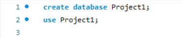
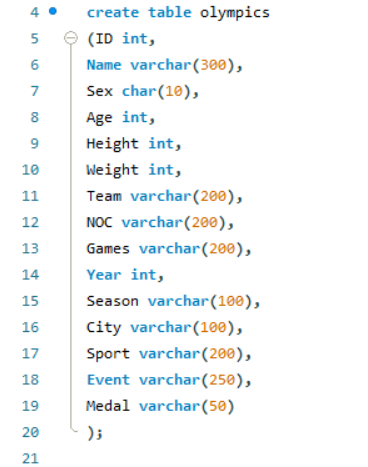
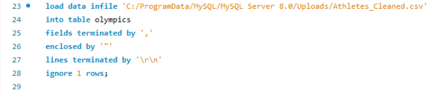

<h1 align="center">Olympics Data Analysis with SQL</h1>

The goal of this project is to become acquainted with SQL concepts by solving real-world data questions; it will be accomplished by downloading 120 years of Summer and Winter Olympics History till 2016 dataset from Kaggle and answering each question provided by techTFQ accordingly.

The Tables used in this project are:

olympics_history: it contains all players that have participated in the Olympics till 2016 including their age, sex, national Olympic committee (noc), Olympic game, sport, event and medal type if they won
olympics_history_noc_regions: it contains all national olympic committees that represent countries with their old and new names from 1896 to 2016
The Goal of the project is to answer 20 questions related to the Olympics by making SQL query for each one of them and the Questions are:

1. Show how many medal counts present for entire data.
2. Show count of unique sports present in Olympics.
3. Show how many different medals won by team India.
4. Show event wise medals won by India show from highest to lowest medals won in order.
5. Show event wise medals won by India in order of year.
6. show country who won maximum medals.
7.show top 10 countries who won gold.
8. show in which year did United states won most gold medal.
9. In which sports United States has most medals.
10. Find top three players who won most medals along with their sports and country.
11. Find player with most gold medals in cycling along with his country.
12. Find player with most medals (Gold+Silver+Bronze) in Basketball also show his country.
13. Find out the count of different medals of the top basketball player Teresa Edwards.
14. Find out medals won by male,female each year , Export this data and plot graph in excel.

## Setup

1. Create a MySQL database named `project_1`.

2. Create a table named `Olympics` to store the dataset.
   

3. Load Data from CSV file

## Queries and Analysis

1. **Show how many medals counts present for entire data**

   
   
   Result⬇️

   

2. **Show count of unique sports present in Olympics**

   
   
   Result⬇️

   
   
3. **Show how many different medals won by team India**

   
   
   Result⬇️

   

4.**Show event wise medals won by India show from highest to lowest medals won in order**

   
   
   Result⬇️

   

5.**Show event wise medals won by India in order of year**
 
   
   
   Result⬇️

   
   
6.**Top 10 country who won maximum medals.**
 
   
    
   Result⬇️

   

7.**show top 10 countries who won gold**

   
   
   Result⬇️

   

8.**show in which year did United states won most gold medal**

   
   
   Result⬇️

   

9.**Top 10 sports in which United States has most medals.**

   
   
   Result⬇️

   

10.**Find top three players who won most medals along with their sports and country**

   
   
   Result⬇️

   

11.**Find player with most gold medals in cycling along with his country.**

   
   
   Result⬇️

   

12.**Find player with most medals (Gold+Silver+Bronze) in Basketball also show his country**

   
   
   Result⬇️

   

13.**Find out the count of different medals of the top basketball player Teresa Edwards**

   
   
   Result⬇️

   

14.**Find out medals won by male, female each year**

   
   
   Result⬇️

   

   
   

## Insights Summary

- **Medal Distribution:** The dataset contains information on medals awarded in various Olympic events, indicating the overall competitiveness and achievement levels across different sports and countries.
- **Sport Diversity:** With a count of unique sports present in the dataset, it's evident that the Olympics encompass a wide range of sporting disciplines, showcasing the diversity and inclusivity of the event.
- **India's Performance:** Team India has participated in Olympic events and achieved success, as shown by the medals won. The breakdown of medals by event and year provides insights into India's strengths and areas of success in Olympic competition.
- **Global Performance:** The analysis of medal counts by country highlights the competitive landscape of the Olympics, showcasing countries with significant success in terms of medal acquisition.
- **Gold Medal Dominance:** The identification of countries with the most gold medals emphasizes the importance and prestige associated with winning gold in Olympic competition.
- **United States' Dominance:** The queries focusing on the United States reveal the country's remarkable success in the Olympics, both in terms of overall medal counts and gold medal achievements across different sports and years.
- **Top Performers:** Highlighting top-performing athletes and their achievements provides insights into individual excellence and contributions to their respective countries' success in the Olympics.
- **Gender Disparity:** The analysis of medals won by gender each year sheds light on gender-based trends and disparities in Olympic participation and success, offering insights into the representation and performance of male and female athletes over time.

